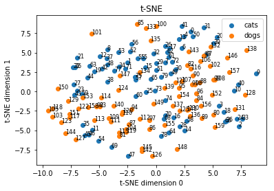

# High-dimensional-data-analysis

There are two datasets containing pictures of cats and dogs. The pictures are stored as text in the CSV files. The files contain a matrix with 4096 rows and 80 columns. Each column is a single pet and each value of the columns shows brightness of a pixel. Examples of images are shown below:

 

In this work you can find visualization of the high dimensional data on 2 and 3 dimensional space using PCA and t-SNE. Examples of the 2D charts are shown below, other charts you can see in pets.ipynb

 

# Requirements

In this work, Python3.6 and the following packages are used: 
- numpy,
- pandas,
- Matplotlib,
- sklearn.

You can install each package separately or install Anaconda3, which includes all of them.

To run this project you can clone or download it and open pets.ipynb in Jupyter notebook.

Tests are provided on the following configuration:
-	OS: Windows 10 x 64
-	Processor: Intel® Core™ i5-7300HQ CPU @2.50 GHz
-	RAM: 8GB

